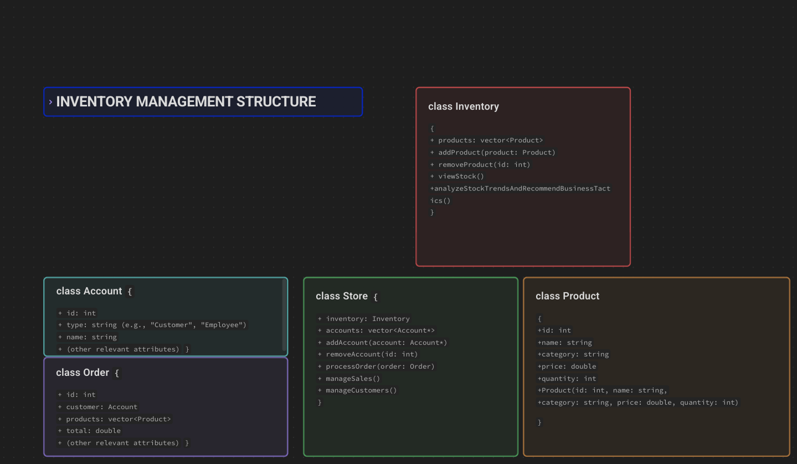

## Store Management system
---

#### Introduction

This repository contains a C++ implementation of a store system, designed to manage user accounts, seller accounts, inventory, and store operations. It provides functionalities for users to purchase products, sellers to manage their inventory, and administrators to oversee the system.

---

#### Components

1. **Accounts**:
   - **Account**: Base class representing user accounts. It encapsulates a username and password and provides authentication functionality.
   - **UserAccount**: Derived class representing user accounts. It includes a balance attribute for managing user finances.
   - **SellerAccount**: Derived class representing seller accounts. It enables sellers to view users' balances.

2. **Inventory**:
   - **Product**: Class representing products available in the inventory. It includes attributes such as ID, name, category, price, and quantity.
   - **Inventory**: Manages the collection of products. It provides methods for adding, removing, and viewing products, as well as analyzing stock trends.

3. **Store**:
   - **Store**: Combines functionalities related to inventory and accounts management within the store.

---

#### Usage

1. **Accounts Management**:
   - Users and sellers can create accounts with unique usernames and passwords.
   - Users can check their balance and update it accordingly.
   - Sellers can view users' balances.

2. **Inventory Management**:
   - Sellers can add products to their inventory, specifying product details like name, category, price, and quantity.
   - Sellers can remove products from their inventory.
   - Sellers can view their current stock of products.
   - Inventory allows analyzing stock trends to recommend business tactics.

3. **Store Operations**:
   - The Store class integrates accounts and inventory functionalities for comprehensive store management.

---

#### Compilation and Execution

To compile and execute the store system:

1. Ensure you have a C++ compiler installed on your system.
2. Clone the repository to your local machine.
3. Navigate to the directory containing the source files.
4. Compile the source files using your preferred C++ compiler.
5. Run the executable generated after compilation.

Example commands (using g++ compiler):

```bash
g++ main.cpp -o store_system
./store_system
```

---

#### Contributions

Contributions to this repository are welcome. If you find any bugs or have suggestions for improvements, feel free to submit a pull request or open an issue.

---

#### License

This repository is licensed under the [MIT License](https://opensource.org/licenses/MIT). Feel free to use, modify, and distribute the code for personal or commercial purposes.

---

#### Author

This store system repository is maintained by [Abhijeet/asp616848].
This readme file is completely AI written with the header file code reference alone, read the code for in-depth understanding.

---

Feel free to expand this documentation further based on your project's specific requirements and include details about additional features, usage examples, or any other relevant information.
